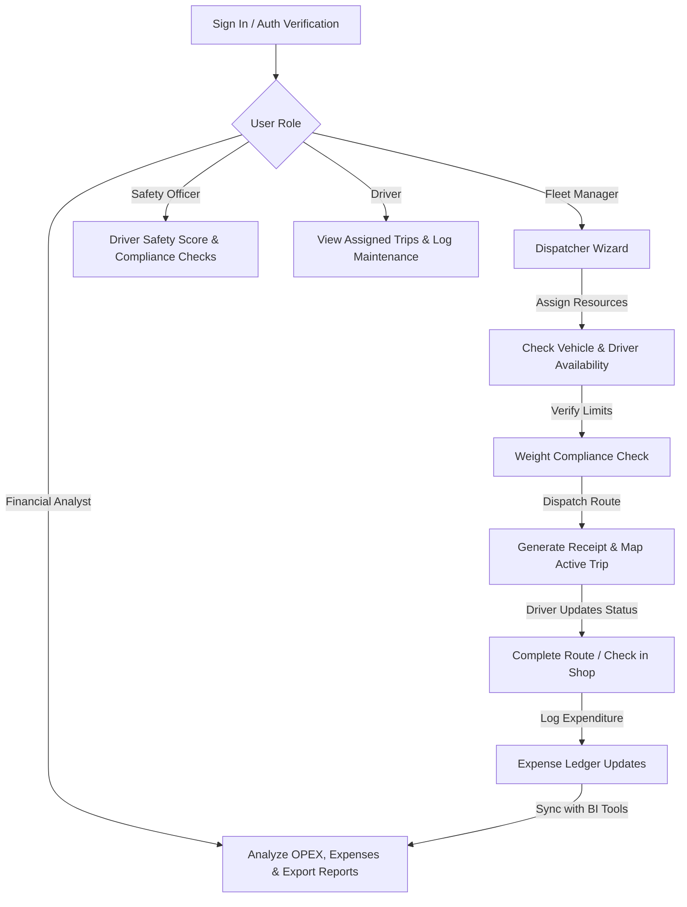

# TransitOps - Enterprise Fleet Logistics Management System

TransitOps is a central logistics, dispatch, and fleet operations dashboard designed for enterprise fleet operators. It enables real-time resource planning, vehicle routing, driver compliance tracking, opex logs, and maintenance scheduling.

---

## 🚀 Key Features & Role-Based Access Control (RBAC)

TransitOps implements a strict Role-Based Access Control system to ensure users only interact with sections relevant to their duties:

| Role                  | Access Permissions                                                               |
| :-------------------- | :------------------------------------------------------------------------------- |
| **Fleet Manager**     | Manage Fleet Registry, Driver Management, Trip Dispatcher, Maintenance, Expenses  |
| **Financial Analyst**  | Financial Dashboard (Overview), Fleet Registry, Expense & Fuel Analytics, Reports|
| **Safety Officer**    | Driver Compliance, Maintenance scheduling, Safety Reports                        |
| **Driver**            | View assigned Trips, update Maintenance/Service tasks                            |

### 🛠️ Core Modules:
* **Interactive Dashboards:** Real-time analytics, cost trends, and active dispatches tracked with custom **Recharts** visualizations.
* **Dispatcher Wizard:** A step-by-step route wizard that ensures resource availability, calculates fuel efficiency, enforces cargo limits, and exports text-based dispatch receipts.
* **Fleet Registry:** Inventory registry of vehicles, categorizing them by status (Available, On Trip, In Shop) with built-in **Excel Export**.
* **Driver Management:** Track driver licenses, categories, contact numbers, and monitor their safety score index.
* **Maintenance & Repair Scheduler:** Manage scheduled services, route vehicles to repair shops, and trace odometer milestones.
* **Fuel & Expense Tracker:** Logs fuel volumes, calculates average pricing/consumption, and projects future operational costs.
* **Responsive Layouts:** Designed to scale beautifully from widescreen desktop layouts to snappier overlay drawer sidebar setups on tablets and smartphones.

---

## 🔄 Project Workflow



### Typical Operational Loop:
1. **Fleet Dispatch:** The Fleet Manager opens the **Dispatcher Wizard**, select source/destination hubs, selects an available vehicle and an available driver, sets cargo details (checking against maximum payload limits), and dispatches the trip. 
2. **Receipt & Logistics:** The system automatically generates a text-based dispatch receipt download and marks the assigned vehicle and driver status as `"On Trip"`.
3. **Driver Updates:** The Driver views active routes on their dashboard. If any maintenance issues arise, they route the vehicle to the workshop which moves the vehicle status to `"In Shop"`.
4. **Safety & Compliance:** The Safety Officer reviews driver reports and manages service schedules to maintain a high safety compliance rating.
5. **OPEX Review:** The Financial Analyst reviews monthly fuel trends, general opex bar charts, and exports structured spreadsheets to Excel.

---

## 🛠️ Technology Stack

### Frontend:
* **Framework:** React 19 (Vite)
* **Styling:** Tailwind CSS (Custom Responsive Layouts)
* **Routing:** React Router DOM (Role Guards via `ProtectedRoute`)
* **State & Auth:** React Context API
* **Charts:** Recharts
* **Icons:** Lucide React
* **Maps:** Leaflet & React-Leaflet
* **Notifications:** React Hot Toast
* **Exports:** SheetJS (`xlsx`)

### Backend:
* **Runtime:** Node.js
* **Framework:** Express
* **Database:** MongoDB Atlas & Mongoose ODM
* **Authentication:** JSON Web Tokens (JWT) & Bcryptjs
* **Process Manager:** Nodemon (Development)

---

## 📂 Project Structure

```
TransitOps/
├── backend/
│   ├── config/             # DB connections & environment setup
│   ├── controllers/        # Express route handlers
│   ├── models/             # Mongoose database schemas
│   ├── routes/             # REST API routing
│   ├── index.js            # Server entrypoint
│   └── package.json
│
├── frontend/
│   ├── src/
│   │   ├── assets/         # Images & static assets
│   │   ├── components/     # Layouts (Header, Sidebar, ProtectedRoute)
│   │   ├── context/        # React Auth State Provider
│   │   ├── pages/          # Login, Register & Home pages
│   │   │   └── dashboards/ # Overview, Fleet, Drivers, Trips, Reports, Settings
│   │   ├── index.css       # Core stylesheets
│   │   └── main.jsx        # Frontend entrypoint
│   ├── package.json
│   └── vite.config.js
│
├── package.json            # Root configuration for concurrent execution
└── README.md
```

---

## ⚙️ Installation & Setup

### Prerequisites:
Ensure you have **Node.js** (v18+) and **npm** installed on your local machine.

### Step 1: Install Dependencies
Run `npm install` at the root directory to set up the concurrently running runner, then install dependencies for both the frontend and backend.

```bash
# Install root script runner
npm install

# Install backend packages
cd backend && npm install

# Install frontend packages
cd ../frontend && npm install
```

### Step 2: Configure Environment Variables
Create a `.env` file inside the `backend` directory:

```env
PORT=5000
MONGO_URI=your_mongodb_connection_string
JWT_SECRET=your_jwt_secret_key
```

### Step 3: Run the Application
Start both the backend server and frontend development client concurrently using the root startup script:

```bash
# Run from the root directory
npm start
```

* **Frontend running at:** `http://localhost:5173/`
* **Backend running at:** `http://localhost:5000/`
